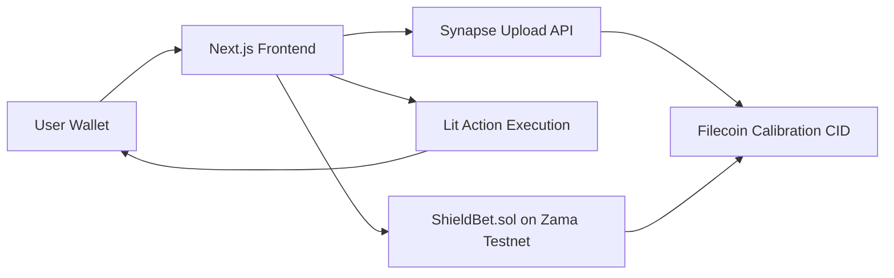

# ShieldBet

Confidential prediction markets prototype for PL Genesis 2026.

ShieldBet implements a two-surface dApp (Markets dashboard + Bet page) backed by a market smart contract with encrypted-position interfaces, resolution flow, claim logic, and Filecoin/Lit integrations.

## Monorepo Layout

- `contracts/`: Hardhat project with `ShieldBet.sol`, tests, and deploy script.
- `frontend/`: Next.js app with RainbowKit wallet connect, dashboard, bet page, Synapse Filecoin upload route, and Lit-assisted claim verification flow.

## Architecture



## Smart Contract Scope

`contracts/contracts/ShieldBet.sol` includes:

- `createMarket(question, deadline) -> marketId`
- `placeBet(marketId, externalEuint8, externalEuint64, inputProof)` (payable)
- `resolveMarket(marketId, outcome)` (`onlyOwner`)
- `assignWinnerPayout(marketId, winner, payoutAmount)` (`onlyOwner`)
- `claimWinnings(marketId)`
- `getMyBet(marketId) -> euint64 handle`
- `getMyOutcome(marketId) -> euint8 handle`
- CID anchoring hooks:
  - `anchorMarketMetadataCID(marketId, cid)`
  - `anchorResolutionCID(marketId, cid)`

Notes:
- Uses official FHEVM primitives (`FHE.fromExternal`, `FHE.add`, `FHE.select`, `FHE.allowThis`, `FHE.allow`).
- Winner payouts are assigned by owner/oracle flow after resolution.

## Frontend Scope

`frontend` implements:

- Wallet connection via wagmi + RainbowKit
- `/markets` dashboard with:
  - market cards
  - open/resolved status
  - encrypted volume label
  - market/resolution CID links
  - claim CTA for eligible winners
- `/markets/[id]` bet page with:
  - YES/NO selection
  - amount entry
  - client-side encryption with `@zama-fhe/relayer-sdk`
  - confidential position confirmation
  - owner admin controls (resolve + assign payout)
  - claim flow + Lit response reveal
- `app/api/filecoin/upload`:
  - uploads canonical market/resolution JSON payloads to Filecoin via Synapse SDK
  - returns a real PieceCID for on-chain anchoring
- `app/api/lit/claim`:
  - verifies `WinningsClaimed` event data from claim tx receipt
  - returns verified payout and optional Lit attestation payload

## Quick Start

### 1) Contracts

```bash
cd /Users/sam/Desktop/Projects/ShieldBet/contracts
npm install
npm test
```

Deploy:

```bash
cp .env.example .env
# set ZAMA_RPC_URL and DEPLOYER_PRIVATE_KEY
npm run deploy:zama
```

### 2) Frontend

```bash
cd /Users/sam/Desktop/Projects/ShieldBet/frontend
npm install
cp .env.example .env.local
# set NEXT_PUBLIC_SHIELDBET_ADDRESS and chain values
npm run dev
```

Open [http://localhost:3000](http://localhost:3000)

## Env Configuration

### Contracts (`contracts/.env`)

- `ZAMA_RPC_URL`
- `DEPLOYER_PRIVATE_KEY`

### Frontend (`frontend/.env.local`)

- `NEXT_PUBLIC_CHAIN_ID`
- `NEXT_PUBLIC_CHAIN_NAME`
- `NEXT_PUBLIC_CHAIN_RPC_URL`
- `NEXT_PUBLIC_CHAIN_EXPLORER`
- `NEXT_PUBLIC_SHIELDBET_ADDRESS`
- `NEXT_PUBLIC_WALLETCONNECT_PROJECT_ID`
- `NEXT_PUBLIC_FHEVM_RELAYER_URL`
- `NEXT_PUBLIC_FHEVM_ACL_CONTRACT`
- `NEXT_PUBLIC_FHEVM_KMS_CONTRACT`
- `NEXT_PUBLIC_FHEVM_INPUT_VERIFIER_CONTRACT`
- `NEXT_PUBLIC_FHEVM_VERIFY_DECRYPTION_CONTRACT`
- `NEXT_PUBLIC_FHEVM_VERIFY_INPUT_CONTRACT`
- `NEXT_PUBLIC_FHEVM_GATEWAY_CHAIN_ID`
- `NEXT_PUBLIC_LIT_ACTION_CID` (optional, enables Lit Action execution in claim flow)
- `NEXT_PUBLIC_LIT_NETWORK` (optional, default: `datil`)
- `FILECOIN_UPLOAD_MODE` (`synapse` or `mock`)
- `FILECOIN_NETWORK` (`calibration`, `mainnet`, `devnet`)
- `FILECOIN_RPC_URL` (optional custom RPC URL for selected Filecoin network)
- `FILECOIN_WALLET_PRIVATE_KEY` (required for `synapse` mode)
- `FILECOIN_WITH_CDN` (optional, default `false`)

## Demo Flow (PRD-aligned)

1. Open `/markets`, connect wallet.
2. Open a market and place an encrypted bet (payload encoded client-side).
3. Resolve market from owner wallet (`resolveMarket`).
4. Assign winner payout from owner wallet (`assignWinnerPayout`).
5. Claim winnings from winner wallet.
6. Verify anchored CIDs from dashboard links.

## Next Integration Tasks

- Move winner payout assignment from manual admin input to oracle/Lit Action automation.
- Add explicit Lit Action response schema validation and replay protection.
