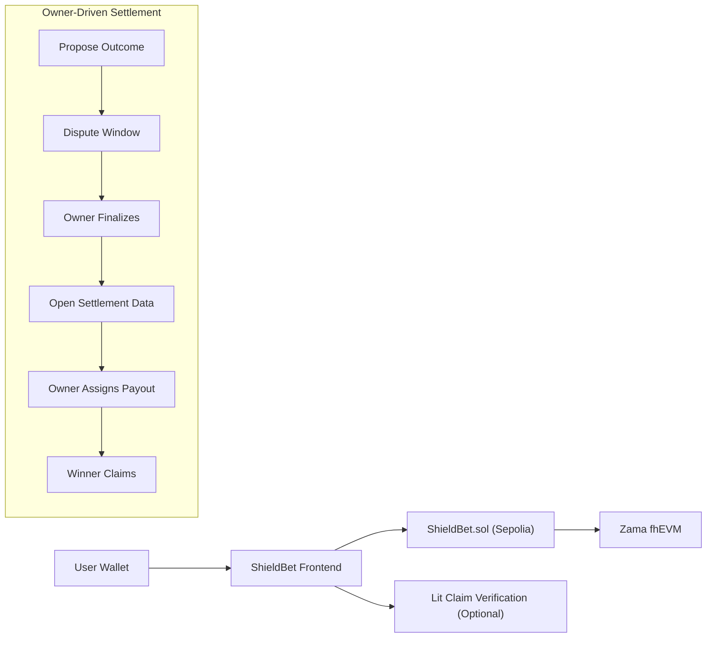

# ShieldBet

ShieldBet is a confidential prediction market prototype built with Zama fhEVM and a Next.js frontend.

This stabilized v1 uses an **owner-driven settlement model**:

- bet **stake amounts are public ETH**
- bet **side selection is encrypted** with fhEVM
- outcome resolution follows an **optimistic oracle flow**
- payouts are **assigned manually by the owner** after finalization
- Lit is **optional post-claim attestation**, not the on-chain authority

Filecoin is deferred for this phase.

## Monorepo Layout

- `contracts/`: Hardhat project for `ShieldBet.sol`, tests, deploy script, and Sepolia e2e script
- `frontend/`: Next.js app for the markets board, market detail page, create market flow, and optional Lit claim verification

## Stabilized v1 Flow



## Smart Contract Scope

Canonical market lifecycle for this phase:

- `createMarketWithMetadata(question, deadline, marketType, outcomeLabels, category, resolutionCriteria, resolutionSource)`
- `placeBet(marketId, externalEuint8, inputProof)` payable
- `proposeOutcome(marketId, outcomeIndex)` payable
- `challengeOutcome(marketId)` payable
- `finalizeOutcome(marketId, finalOutcome)` onlyOwner
- `openSettlementData(marketId, bettors)`
- `assignPayoutManual(marketId, winner, payout)` onlyOwner
- `claimWinnings(marketId)`

Useful read helpers exposed by the contract:

- `markets(marketId)`
- `getMarketDetails(marketId)`
- `getOutcomeLabels(marketId)`
- `getMyOutcome(marketId)`
- `stakeAmounts(marketId, account)`
- `claimablePayouts(marketId, account)`
- `hasPosition(marketId, account)`
- `hasClaimed(marketId, account)`

## Frontend Scope

The frontend currently supports:

- wallet connection with wagmi + RainbowKit
- `/markets` market board
- `/markets/[id]` market detail page with:
  - encrypted-side bet placement
  - optimistic oracle actions
  - settlement opening
  - owner payout assignment
  - direct `claimWinnings()` flow
- `/create` market creation
- `/my-bets` portfolio view
- `/api/lit/claim` optional post-claim verification against the `WinningsClaimed` event

## Quick Start

### Contracts

```bash
cd /Users/sam/Desktop/Projects/ShieldBet/contracts
npm install
npm test
```

Deploy to Sepolia:

```bash
cp .env.example .env
# set ZAMA_RPC_URL and DEPLOYER_PRIVATE_KEY
npm run deploy:zama
```

Run the live Sepolia lifecycle demo:

```bash
cd /Users/sam/Desktop/Projects/ShieldBet/contracts
npm run e2e:sepolia
```

### Frontend

```bash
cd /Users/sam/Desktop/Projects/ShieldBet/frontend
npm install
cp .env.example .env.local
# set NEXT_PUBLIC_SHIELDBET_ADDRESS and chain / fhEVM values
npm run dev
```

Open [http://localhost:3000](http://localhost:3000)

## Environment Variables

### `contracts/.env`

- `ZAMA_RPC_URL`
- `DEPLOYER_PRIVATE_KEY`
- `SHIELDBET_ADDRESS` (optional for the Sepolia e2e script)

### `frontend/.env.local`

- `NEXT_PUBLIC_CHAIN_ID`
- `NEXT_PUBLIC_CHAIN_NAME`
- `NEXT_PUBLIC_CHAIN_RPC_URL`
- `NEXT_PUBLIC_CHAIN_EXPLORER`
- `NEXT_PUBLIC_SHIELDBET_ADDRESS`
- `NEXT_PUBLIC_WALLETCONNECT_PROJECT_ID`
- `NEXT_PUBLIC_FHEVM_RELAYER_URL`
- `NEXT_PUBLIC_FHEVM_ACL_CONTRACT`
- `NEXT_PUBLIC_FHEVM_KMS_CONTRACT`
- `NEXT_PUBLIC_FHEVM_INPUT_VERIFIER_CONTRACT`
- `NEXT_PUBLIC_FHEVM_VERIFY_DECRYPTION_CONTRACT`
- `NEXT_PUBLIC_FHEVM_VERIFY_INPUT_CONTRACT`
- `NEXT_PUBLIC_FHEVM_GATEWAY_CHAIN_ID`
- `NEXT_PUBLIC_LIT_ACTION_CID` (optional)
- `NEXT_PUBLIC_LIT_NETWORK` (optional, recommended: `naga-dev`)

## Browser Acceptance Flow

This is the v1 release gate:

1. Create a market from `/create`
2. Place an encrypted-side bet from `/markets/[id]`
3. Wait for the market deadline
4. Propose an outcome with the oracle stake
5. Optionally challenge during the dispute window
6. Finalize from the owner wallet after the dispute window
7. Open settlement data for the relevant bettors
8. Assign payout manually from the owner wallet
9. Claim winnings from the winning wallet
10. Optionally verify the claim receipt through Lit attestation

## Current Product Truth

- Zama handles **confidential side selection**
- ETH stake remains **public**
- Lit is **non-authoritative** in this phase
- Filecoin is **out of scope** in this phase
- Settlement remains **owner-administered**

## Next Steps After Stabilization

- move payout assignment from manual owner entry to Lit-assisted automation
- reduce participation leakage beyond wallet-level on-chain visibility
- add a stronger decentralized resolution authority if we promote Lit from optional attestation to settlement authority
